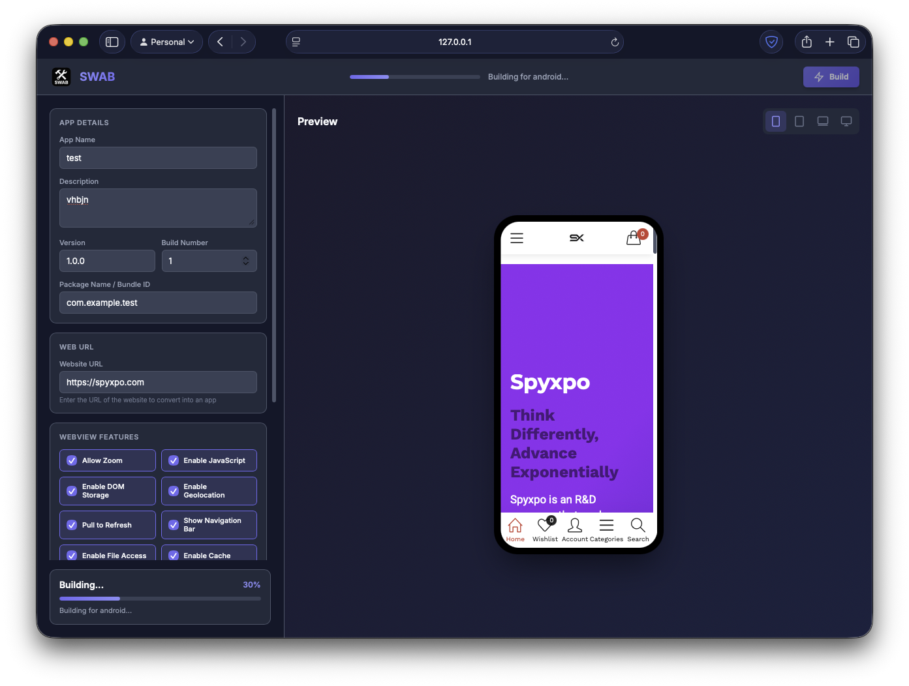

# SWAB - Spyxpo Web to App Builder

Convert any website into a native application for iOS, Android, macOS, Windows, and Linux with a simple web-based interface.

---

## Table of Contents

- [Overview](#overview)
- [Features](#features)
- [Supported Platforms](#supported-platforms)
- [Prerequisites](#prerequisites)
- [Installation](#installation)
- [Usage](#usage)
  - [Starting the Server](#starting-the-server)
  - [Building an App](#building-an-app)
  - [WebView Configuration Options](#webview-configuration-options)
- [Project Structure](#project-structure)
- [API Reference](#api-reference)
- [Demo Video](#demo-video)
- [Screenshots](#screenshots)
- [TODO](#todo)
- [Contributing](#contributing)
- [License](#license)
- [Authors](#authors)

---

## Overview

SWAB (Spyxpo Web to App Builder) is a Flask-based tool that transforms websites into native applications using Flutter's WebView capabilities. It provides a modern web interface for configuring app settings and building platform-specific executables without writing any code.

> **Note:** This is a preview build for testing purposes. A major update is coming soon.

---

## Demo Video


https://github.com/user-attachments/assets/7bbd267e-6391-4d23-b0f1-55d98281cf0a

## Screenshots



## Features

- **Multi-Platform Support** - Build apps for Android, iOS, macOS, Windows, and Linux from a single configuration
- **Web-Based Interface** - Intuitive UI with real-time device preview
- **Customizable WebView** - Fine-grained control over WebView behavior and features
- **Live Preview** - Preview your website in different device frames before building
- **Progress Tracking** - Real-time build progress updates
- **Android Signing** - Support for custom keystore files for Android release builds
- **No Coding Required** - Convert any website to an app without writing code

## TODO

### High Priority

- [ ] Add iOS code signing support
- [ ] Implement user authentication for build management
- [ ] Deploy a hosted version of SWAB
- [ ] Add support for push notifications (Firebase/APNs)

### App Customization

- [ ] Custom splash screen with configurable duration and animation
- [ ] App icon generator from uploaded image (auto-resize for all platforms)
- [ ] Custom loading indicator styles (spinner, progress bar, skeleton)
- [ ] Offline mode with custom offline page
- [ ] Deep linking / URL scheme support
- [ ] Custom user agent string configuration
- [ ] Inject custom CSS/JavaScript into WebView
- [ ] Dark mode support with auto-detection

### Security & Authentication

- [ ] SSL certificate pinning for enhanced security
- [ ] Biometric authentication (Face ID / Touch ID / Fingerprint)
- [ ] App password/PIN lock feature
- [ ] Secure storage for sensitive data

### Platform Features

- [ ] Native share functionality
- [ ] File download manager with progress tracking
- [ ] Camera and gallery access from web
- [ ] QR code / barcode scanner integration
- [ ] Native contact picker access
- [ ] Clipboard integration
- [ ] Local notifications support
- [ ] Background sync capabilities
- [ ] App shortcuts (Android) / Quick Actions (iOS)

### Build & Distribution

- [ ] Optimize build times with caching
- [ ] Multi-app batch building
- [ ] Build history and version management
- [ ] Direct upload to App Store Connect / Google Play Console
- [ ] Generate privacy policy and terms of service pages
- [ ] App size optimization options
- [ ] ProGuard/R8 configuration for Android

### UI/UX Improvements

- [ ] Add more WebView configuration options
- [ ] Native navigation drawer / bottom navigation
- [ ] Custom status bar and navigation bar colors
- [ ] Orientation lock options (portrait/landscape/both)
- [ ] Safe area handling for notched devices
- [ ] Haptic feedback options
- [ ] Native alert/confirm dialogs

### Analytics & Monitoring

- [ ] Firebase Analytics integration
- [ ] Crash reporting (Crashlytics/Sentry)
- [ ] In-app update prompts
- [ ] Remote configuration support
- [ ] Usage analytics dashboard

### Developer Experience

- [ ] Improve error handling and logging
- [ ] API documentation with Swagger/OpenAPI
- [ ] CLI tool for headless builds
- [ ] Webhooks for build completion notifications
- [ ] Docker support for consistent build environment
- [ ] Build configuration templates/presets

---

## Supported Platforms

| Platform | Output Format |
|----------|---------------|
| Android | APK |
| Android | AAB (App Bundle) |
| iOS | .app (requires Xcode for signing) |
| macOS | .app (bundled as ZIP) |
| Windows | Executable (bundled as ZIP) |
| Linux | Binary (bundled as ZIP) |

---

## Prerequisites

Before using SWAB, ensure you have the following installed:

- **Python 3.8+**
- **Flutter SDK** (with platform-specific toolchains configured)
- **Platform-Specific Requirements:**
  - **Android:** Android SDK, Android Studio
  - **iOS/macOS:** Xcode (macOS only)
  - **Windows:** Visual Studio with C++ workload
  - **Linux:** Clang, CMake, GTK development libraries

---

## Installation

1.Clone the repository:

```bash
git clone https://github.com/user/swab.git
cd swab
```

2.Create and activate a virtual environment:

```bash
python3 -m venv venv
source venv/bin/activate  # On Windows: venv\Scripts\activate
```

3.Install dependencies:

```bash
pip install -r requirements.txt
```

4.Verify Flutter is properly configured:

```bash
flutter doctor
```

---

## Usage

### Starting the Server

Run the Flask application:

```bash
python app.py
```

The web interface will be available at `http://localhost:5000`.

### Building an App

1. Open the web interface in your browser
2. Fill in the app details:
   - **App Name** - Display name for your application
   - **Description** - Brief description of the app
   - **Version** - Semantic version number (e.g., 1.0.0)
   - **Build Number** - Integer build number for updates
   - **Package Name** - Unique identifier (e.g., com.example.myapp)
3. Enter the website URL to convert
4. Configure WebView options as needed
5. Select the target platform from the dropdown
6. Click **Build** and wait for completion
7. Download the generated app package

### WebView Configuration Options

| Option | Description | Default |
|--------|-------------|---------|
| Allow Zoom | Enable pinch-to-zoom functionality | Enabled |
| Enable JavaScript | Run JavaScript in the WebView | Enabled |
| Enable DOM Storage | Allow localStorage and sessionStorage | Enabled |
| Enable Geolocation | Allow location access requests | Enabled |
| Pull to Refresh | Enable pull-down refresh gesture | Enabled |
| Show Navigation Bar | Display back/forward navigation controls | Enabled |
| Enable File Access | Allow access to local files | Enabled |
| Enable Cache | Cache web content for offline access | Enabled |
| Media Autoplay | Automatically play media content | Disabled |

---

## Project Structure

```txt
swab/
├── app.py                 # Flask application and build logic
├── requirements.txt       # Python dependencies
├── templates/
│   ├── ui/               # Web interface templates
│   └── webview_app/      # Flutter WebView template
├── static/
│   ├── css/              # Stylesheets
│   ├── js/               # JavaScript files
│   └── images/           # Static images
├── builds/               # Generated build outputs
└── uploads/              # Uploaded keystore files
```

---

## API Reference

### Start Build

```bash
POST /api/build
```

**Request Body:**

```json
{
  "app_name": "My App",
  "app_description": "App description",
  "app_version": "1.0.0",
  "build_number": 1,
  "package_name": "com.example.myapp",
  "web_url": "https://example.com",
  "platforms": ["android"],
  "allow_zoom": true,
  "enable_javascript": true
}
```

**Response:**

```json
{
  "build_id": "uuid-string"
}
```

### Check Build Status

```bash
GET /api/build/<build_id>/status
```

**Response:**

```json
{
  "status": "building",
  "progress": 45,
  "message": "Building for android..."
}
```

### Download Build

```bash
GET /api/build/<build_id>/download/<platform>
```

Returns the built application file as a download.

### Upload Keystore

```bash
POST /api/upload/keystore
```

Upload an Android keystore file for release signing.

---

## Contributing

Contributions are welcome! You can contribute to this project by forking it and making a pull request.

After forking:

```bash
git clone https://github.com/<your-username>/swab.git
cd swab
git checkout -b <your-branch-name>
# after adding your changes
git add .
git commit -m "your commit message"
git push origin <your-branch-name>
```

---

## License

This project is licensed under the MIT License. See the [LICENSE](LICENSE) file for details.

## Authors

- [Amrit Raj Vats](https://github.com/real-byte)
